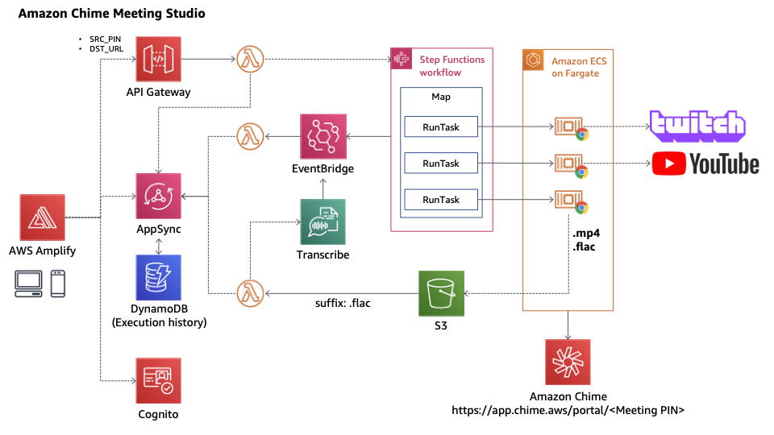

# Amazon Chime Meeting Studio



## Project setup

※ You need to delete `amplify/team-provider-info.json` first.

```sh
git clone https://github.com/mats16/amazon-chime-meeting-studio.git
cd amazon-chime-meeting-studio

rm -f amplify/team-provider-info.json

npm install
amplify init
```

Pleas answer 'No', if you are asked about Lambda Triggers for Cognito.

```
? Do you want to configure Lambda Triggers for Cognito? No
```

### Compiles and hot-reloads for development

```sh
amplify push
npm run serve
```

OR

```sh
amplify serve
```

### Customize configuration
See [Configuration Reference](https://cli.vuejs.org/config/).
